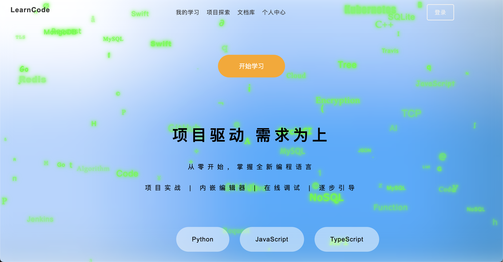
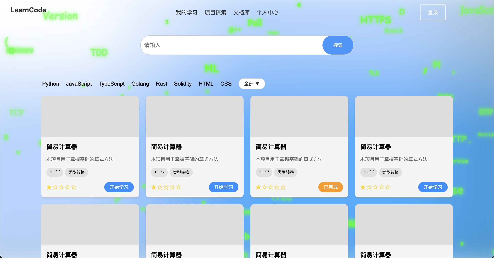
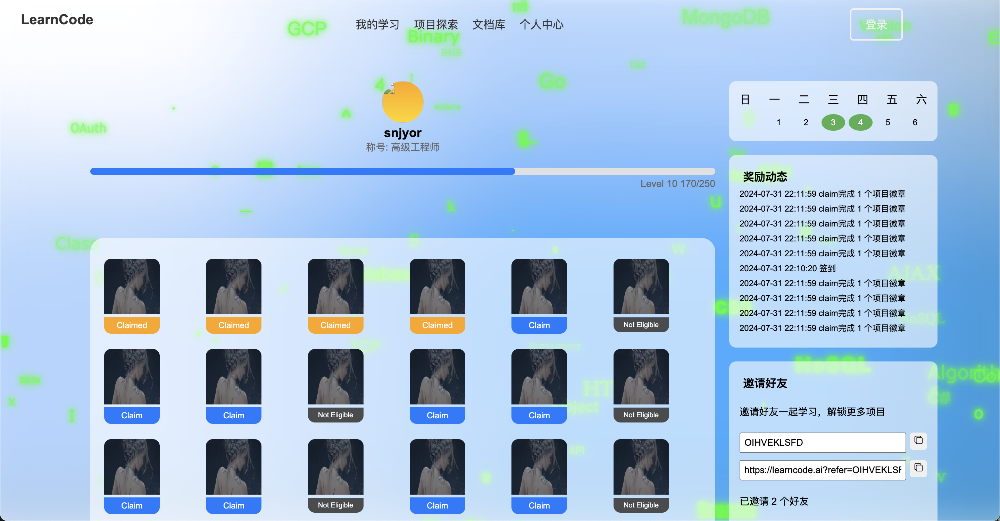
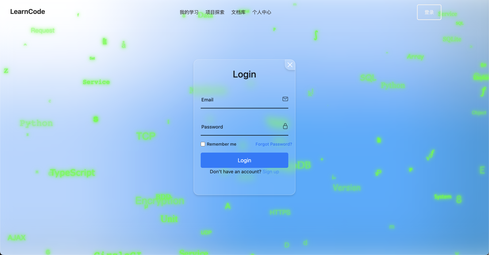
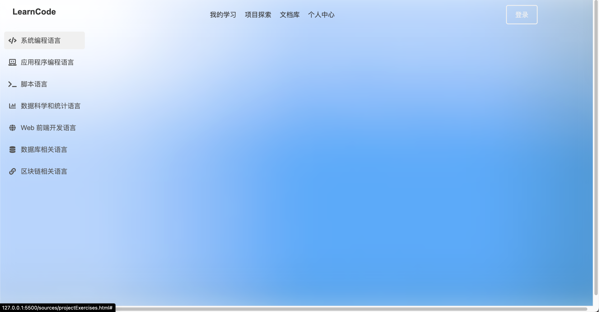

# LearnCode
在线静态页面：https://snjyor.github.io/learncode_frontend/
LearnCode是一个项目驱动、需求导向的编程学习平台。通过实际项目和需求,帮助学习者从零开始掌握新的编程语言。

## 技术栈
HTML, CSS, JavaScript

## 特点

- 项目驱动学习
- 内置代码编辑器
- 在线调试功能  
- 逐步引导教学

## 用户管理

用户活跃度，学习进度，学习动态，签到，积分，等级，徽章，成就，邀请

## 编程语言课程

- Python
- JavaScript
- TypeScript 
- Golang
- Rust
- Solidity
- HTML & CSS
- 等等

## 主要页面

1. 我的学习
2. 练习页面
3. 项目探索
4. 文档库
5. 个人中心

## 项目页面
#### 主页

#### 我的学习

#### 练习页面

#### 项目探索

#### 文档库

#### 个人中心

